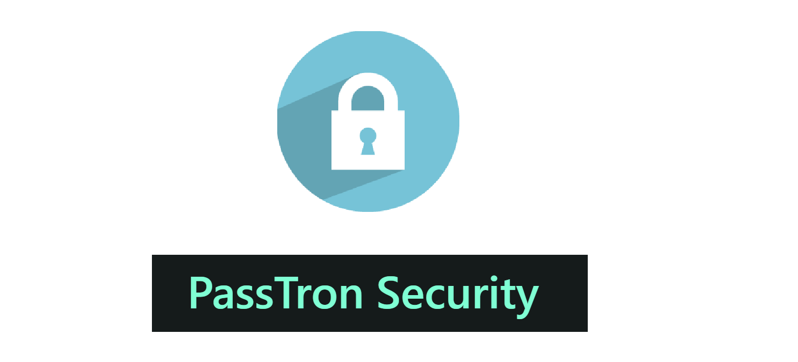
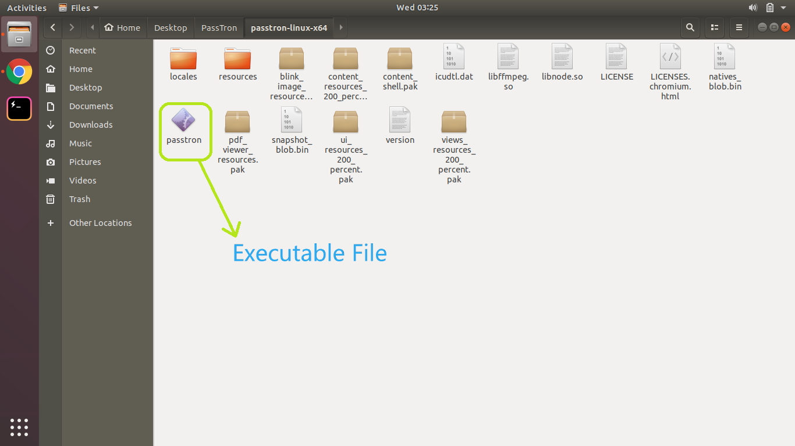

# PassTron

PassTron Security is  a Password manager that stores user's password locally instead of a live database. It can auto generate secured passwords and UI experience is stable.

# Distributions:
**Existing distributions:**  
- [passtron-linux-x64](distributions/linux-x64/passtron-linux-x64)  &emsp;*`Linux-x64`* 
- [passtron-win32-x64](distributions/win32-x64/passtron-win32-x64)  &emsp;*`Windows32-x64`*

      PassTron/distributions/
                |___ linux-x64
                |        |___ passtron-linux-x64
                |
                |___ Win32-x64
                         |___ passtron-win32-x64

# Installation
### 1. Windows32-x64 (Both 32 bit and 64 Bit):
**`Using MSI installer`**
- Click on the below link to download the **`MSI`** installer for **`Windows`**  
[**`PassTron-v0.1.0.msi`**](Installers/Win/PassTron-v0.1.0.msi)
- Once installed, open your Start menu and in your `search explorer` type `PassTron` and click on the `PassTron` executable file.
- If everything works fine, the application should start.
- If you face any error while opening, you need to build the distribution which is super simple. Check the link for [build windows distribution](#build-distributions)

### Optional Info
- Distribution for windows is also present inside `distributions` directory, (win64)  

 
- Navigate to `win64` directory and then double-click on the `passtron.exe` executible file.
- You can also build your package. Check the link for [build windows distribution](#build-distributions)

### 2. Linux (Debian package):
Debian package is yet to be built, but the distribution is created for now.
[**`PassTron-v0.1.0-linuxx64`**](distributions/linux-x64/passtron-linux-x64)
- Clone the repository:

      git clone https://github.com/deepraj1729/PassTron.git
- Navigate to `distributions` and then `linux`
      
      PassTron/distributions/
          |___ linux-x64
                  |___ passtron-linux-x64
 - Inside the `linux-x64` directory,  you will find a executible file, `passtron`:  
 
 
 
 - Open the `passtron` file by double clicking it. If everything works fine, the application should start.
 - If you face any error while opening, you need to build the distribution which is super simple. Check the link for [build linux distribution](#build-distributions)
 
 ### 3. MacOS:
 Package for Mac is not yet built due to OS platform reasons. But creating distribution is super simple.
 Check the link for [build MacOS distribution](#build-distributions)

# UI and Display:
## 1. HomeTab 

## 2. Add Password Tab

## 3. Stored Password DB Tab 

## 4. Developer's Tab

# Usage for `Developers`:
## Pre-Requisites:
- Node.js version: Any latest `LTS` version
- npm version: Any latest `LTS` version
  
## Windows32-x64:
- Clone the repository:
    
      git clone https://github.com/deepraj1729/PassTron.git
- Navigate to `src` directory and then `win64`:
      
      src
       |___win64
            |___ assets/
            |___ public/
            |___ svg/
            |___ views/
            |___ README.md
            |___ build_installer.js
            |___ home.html
            |___ main.js
            |___ package.json

- Install the required `node_modules` from `package.json`
      
      npm i
- Check if the application works:
      
      npm start
    or 
      
      npm run start

## Linux:
- Clone the repository:
    
      git clone https://github.com/deepraj1729/PassTron.git
- Navigate to `src` directory and then `linux`:
      
      src
       |___linux
            |___ assets/
            |___ public/
            |___ svg/
            |___ views/
            |___ README.md
            |___ home.html
            |___ main.js
            |___ package.json

- Install the required libraries:

      sudo apt install libcanberra-gtk-module libcanberra-gtk3-module
- Install the required `node_modules` from `package.json`
      
      npm i
- Check if the application works:
      
      npm start
    or 
      
      npm run start

## MacOS:
- Clone the repository:
    
      git clone https://github.com/deepraj1729/PassTron.git
- Navigate to `src` directory and then `macOS`:
      
      src
       |___macOS
            |___ assets/
            |___ public/
            |___ svg/
            |___ views/
            |___ README.md
            |___ home.html
            |___ main.js
            |___ package.json

- Install the required libraries:

      sudo apt install libcanberra-gtk-module libcanberra-gtk3-module
- Install the required `node_modules` from `package.json`
      
      npm i
- Check if the application works:
      
      npm start
    or 
      
      npm run start

# Build Distributions:
## Pre-Requisites:
Required engine `configurations` to build distributions (any platform)
  - Node.js version: `6.x.x`
  - npm version: `3.x.x`
  
## Windows32-x64:
- Clone the repository:
    
      git clone https://github.com/deepraj1729/PassTron.git
- Navigate to `src` directory and then `win64`:
      
      src
       |___win64
            |___ assets/
            |___ public/
            |___ svg/
            |___ views/
            |___ README.md
            |___ build_installer.js
            |___ home.html
            |___ main.js
            |___ package.json

- Install the required `node_modules` from `package.json`
      
      npm i
- Check if the application works:
      
      npm start
      
    or 
      
      npm run start
- If the application works fine, let's build it
      
      npm run build
- Once done, then there will be a directory called `passtron-win32-x64`

          win64
            |___ assets/
            |___ public/
            |___ svg/
            |___ views/
            |___ `passtron-win32-x64/`
            |___ README.md
            |___ build_installer.js
            |___ home.html
            |___ main.js
            |___ package.json

 - Navigate to this directory and then click on the `passtron.exe`
 - For future use, add this file location in your PATH variable to access it everytime and save passwords in future.
 
## Linux:
- Clone the repository:
    
      git clone https://github.com/deepraj1729/PassTron.git
- Navigate to `src` directory and then `linux`:
      
      src
       |___linux
            |___ assets/
            |___ public/
            |___ svg/
            |___ views/
            |___ README.md
            |___ home.html
            |___ main.js
            |___ package.json

- Install the required libraries:

      sudo apt install libcanberra-gtk-module libcanberra-gtk3-module
- Install the required `node_modules` from `package.json`
      
      npm i
- Check if the application works:
      
      npm start
      
    or 
      
      npm run start
- If the application works fine, let's build it
      
      npm run build
- Once done, then there will be a directory called `passtron-linux-x64`

          linux
            |___ assets/
            |___ public/
            |___ svg/
            |___ views/
            |___ `passtron-linux-x64/`
            |___ README.md
            |___ home.html
            |___ main.js
            |___ package.json

 - Navigate to this directory and then double-click on the `passtron` executible file
 - For future use, add this file location in your `PATH` variable to access it everytime and save passwords in future.
 
## MacOS:
- Clone the repository:
    
      git clone https://github.com/deepraj1729/PassTron.git
- Navigate to `src` directory and then `macOS`:
      
      src
       |___macOS
            |___ assets/
            |___ public/
            |___ svg/
            |___ views/
            |___ README.md
            |___ home.html
            |___ main.js
            |___ package.json

- Install the required libraries:

      sudo apt install libcanberra-gtk-module libcanberra-gtk3-module
- Install the required `node_modules` from `package.json`
      
      npm i
- Check if the application works:
      
      npm start
      
    or 
      
      npm run start
- If the application works fine, let's build it
      
      npm run build
- Once done, then there will be a directory called `passtron-mac-x64`

          macOS
            |___ assets/
            |___ public/
            |___ svg/
            |___ views/
            |___ `passtron-mac-x64/`
            |___ README.md
            |___ home.html
            |___ main.js
            |___ package.json

 - Navigate to this directory and then double-click on the `passtron.app` executible file
 - For future use, add this file location in your `PATH` variable to access it everytime and save passwords in future.

# Ways to Contribute:
- Create issues [here](https://github.com/deepraj1729/PassTron/issues)
- Create pull-requests [here](https://github.com/deepraj1729/PassTron/pulls)
 
### Made With ❤️ by [@deepraj1729](https://github.com/deepraj1729)
 

